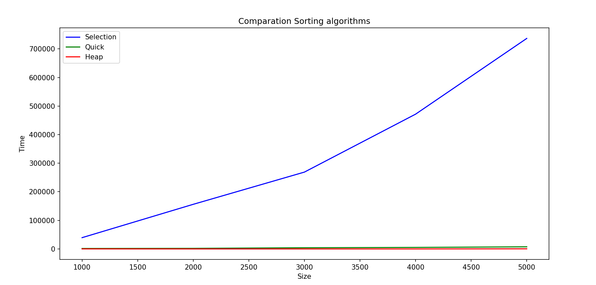
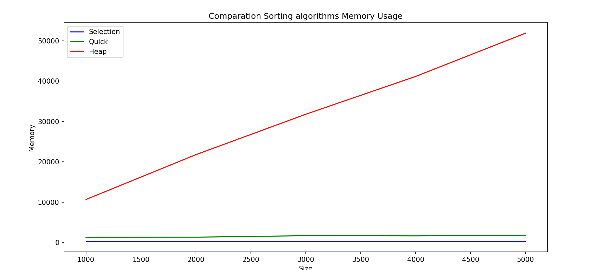
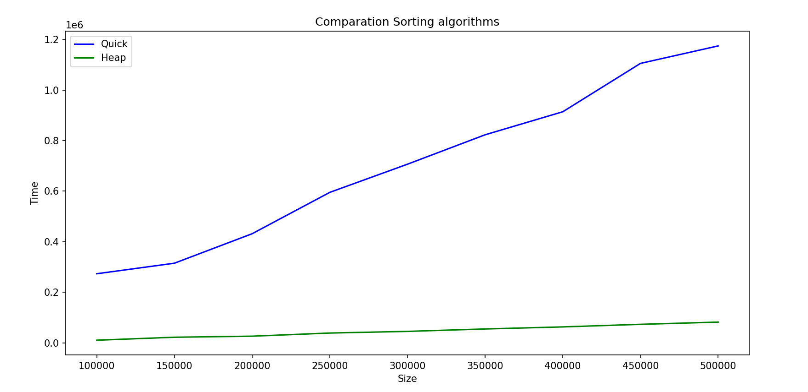
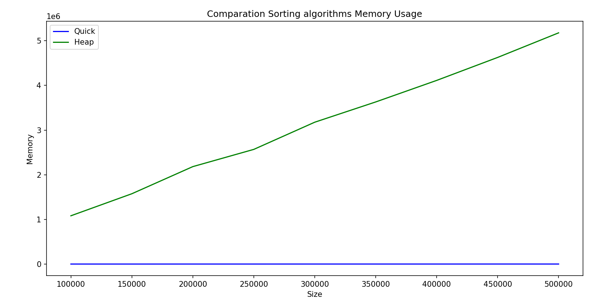

# About this repo

Simple python project to show a way to take experiental execution time to compare a set of algorithms (three in this case) in fair way.

## Sort algorithms

### Problem statement
​
The sproblem is sorting a list of integers

| Algorithm        | Best Case        | Average Case      | Worst Case       | Space Complexity |
|-----------------|-----------------|------------------|------------------|------------------|
| **Selection Sort** | \( O(n^2) \)    | \( O(n^2) \)      | \( O(n^2) \)      | \( O(1) \)       |
| **Quick Sort**   | \( O(n log n) \) | \( O(n log n) \) | \( O(n^2) \) (unbalanced) | \( O(\log n) \) (recursive calls) |
| **Heap Sort**    | \( O(n log n) \) | \( O(n \log n) \) | \( O(n log n) \) | \( O(1) \) (in-place) |


# Python version
Python 3.11.0
​
# Running locally and testing

* Note: This instructions are for mac. Windows or linux may require some changes. 
* A good idea for this project, is to use a virtual environment, you could set up one with: [virtualenv](https://virtualenv.pypa.io/en/latest/).
* To create the virtual environment: `virtualenv env`
* To activate it:`source env/bin/activate`
* To install dependencies: `pip3 install -r requirements.txt`
* To run unit testing: `./test.sh`
* To try a default example, run: `: ./run.sh`. In the file ./run.sh is just an example, you can modify it. Theck the `app.py` file to get to understand how it works.

# Visualization

## Comparation Selection Sort, Quick sort and Heap Sort

| Size  | Selection Sort (Time, Memory) | Quick Sort (Time, Memory) | Heap Sort (Time, Memory) |
|-------|-------------------------------------|---------------------------------|--------------------------------|
| 1000  | (39428, 284)                       | (1603, 1280)                    | (107, 10688)                   |
| 2000  | (156153, 284)                      | (1978, 1344)                    | (0, 21792)                     |
| 3000  | (268911, 284)                      | (4127, 1712)                    | (0, 31808)                     |
| 4000  | (471701, 284)                      | (5284, 1664)                    | (0, 41184)                     |
| 5000  | (736796, 284)                      | (7362, 1808)                    | (397, 51904)                   |






## Comparation Quick sort and Heap Sort

| Size   | Quick Sort (Time, Memory) | Heap Sort (Time, Memory) |
|--------|---------------------------------|--------------------------------|
| 100000 | (273221, 2624)                  | (10355, 1082880)               |
| 150000 | (314937, 2496)                  | (22084, 1576192)               |
| 200000 | (431489, 2752)                  | (26243, 2183232)               |
| 250000 | (595140, 2736)                  | (38722, 2568640)               |
| 300000 | (706530, 2896)                  | (45221, 3177152)               |
| 350000 | (822956, 2880)                  | (54844, 3630560)               |
| 400000 | (914036, 2816)                  | (62965, 4112544)               |
| 450000 | (1105344, 3088)                 | (73154, 4626624)               |
| 500000 | (1174485, 2944)                 | (81960, 5176832)               |







# Current coverage

Make sure you have "coverage" in your requirements.txt file and run pip install. Then run `coverage run -m unittest discover` and after that run `coverage report` to get the following table:

```
Name                          Stmts   Miss  Cover
-------------------------------------------------
sorting\__init__.py               0      0   100%
sorting\algorithms.py            39      0   100%
sorting\constants.py              2      0   100%
sorting\data_generator.py         9      1    89%
test\__init__.py                  0      0   100%
test\test_algorithms.py          22      1    95%
test\test_data_generator.py      29      1    97%
-------------------------------------------------
TOTAL                           101      3    97%
```

# Code beautifier
This code has been beautify using black: https://github.com/psf/black. 
The command to use is `black . -l 120`.
